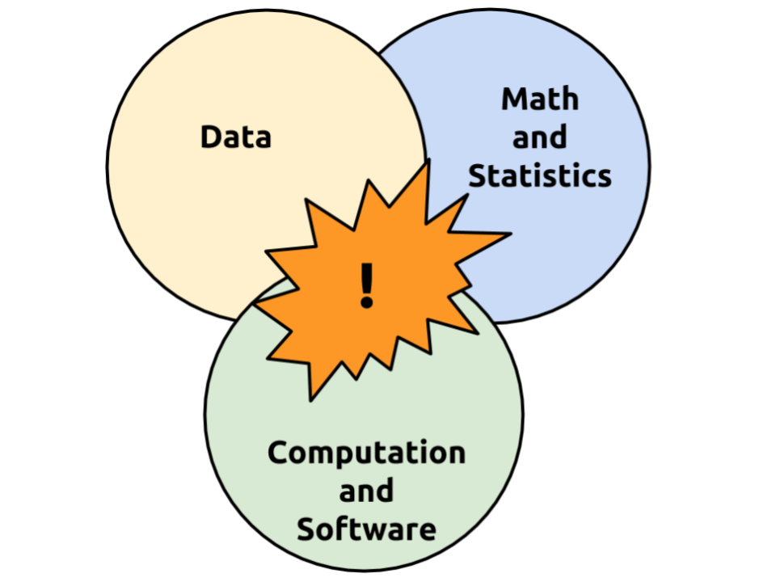
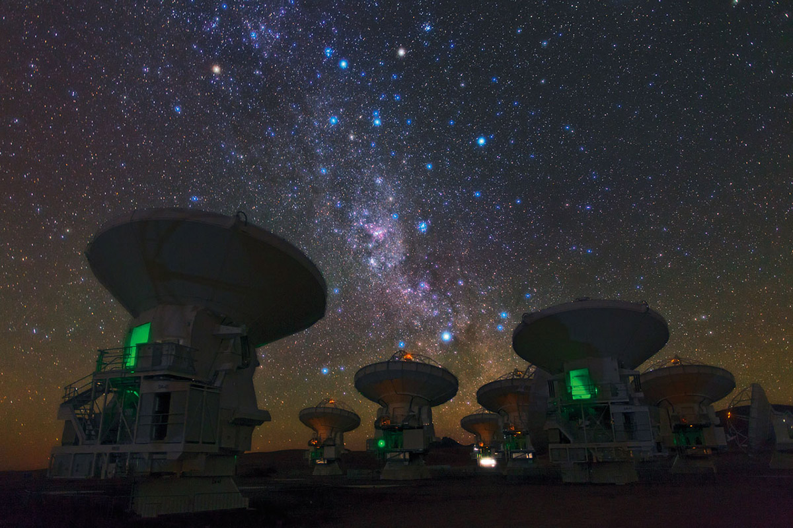

class: center, middle, theBlackBackground

## 2017 Neural Computation and Engineering Connection

## Data Science: Tools and practices for the era of brain observatories

### Ariel Rokem

### The University of Washington eScience Institute

<small>Follow along at: .white[<a href="https://arokem.github.io/2017-01-20-ncec">https://arokem.github.io/2017-01-20-ncec</small>]

---

--

<image src="images/DSE-and-sponsors.png" height=200px>

#### $ 37.8M for 5 years: <a href="http://msdse.org/">"Moore-Sloan Data Science Environments"</a>

Additional funding from
 - Washington Research Foundation  
 - National Science Foundation

---
layout: true

<image src="images/escience-network.png" width=500px style="opacity:0.4;filter:alpha(opacity=40);"> 

---

# Data Science

  <small> <a href="http://onlinelibrary.wiley.com/doi/10.1111/j.1751-5823.2001.tb00477.x/abstract"> Cleveland (2001) </small>   </a>

  <small> <a href="http://www.forbes.com/pictures/lmm45emkh/2-jeff-hammerbacher-chief-scientist-cloudera-and-dj-patil-entrepreneur-in-residence-greylock-ventures/#61b8a2c56d7b">Patil and Hammerbacher (circa 2008)</a> </small>  

  <small> <a href="http://drewconway.com/zia/2013/3/26/the-data-science-venn-diagram">Conway (2013) </a></small>

---
class: theBlackBackground

# The era of brain observatories

--

---

## Brain observatories:

- Allen Institute for Brain Science

--

- UK Biobank

--

### The Human Connectome Project

- More than 1,000 participants
- High-quality measurements of MRI
- Genetics, cognitive measures, etc...

---

# Challenges

--

Analysis and interpretation

--

Scalable computation

--

Reproducibility

--

Training

---

# Statistical intepretation of brain structure

## In collaboration with

- Jason Yeatman (UW ILABS)
- Libby Huber (UW ILABS)
- Rafael Neto Henriques (Cambridge University)

---

layout: true

<image src="images/escience-network.png" width=500px style="opacity:0.4;filter:alpha(opacity=40);"> 

---

### Diffusion MRI

<video preload="auto" width="70%" height="auto" data-setup="{}" autoplay loop ><source src="./videos/dMRI-signal-movie.mp4"/></video>

---

### Human white matter

<video preload="auto" width="60%" height="auto" data-setup="{}" autoplay loop ><source src="./videos/cc_tube_movie.mov"/> </video>

---

layout: true

---

## Models of the white matter

  <small>Basser, Mattielo and Le Bihan (1994)</small>

--

<video width="40%" autoplay loop>
  <source src="./videos/tensor-signal-movie.mp4">
</video>

--

  <image src="./images/q-form.png" style="background:none; border:none; box-shadow:none;" height="70">

--

<video width="70%" autoplay loop>
<source src="./videos/tensor-ellipse-movie.mp4">
</video>

--

style: middle, center

#### Diffusion Tensor Model

---

layout: true

<image src="images/escience-network.png" width=500px style="opacity:0.4;filter:alpha(opacity=40);"> 

---

# Alternative models of diffusion

Modern measurements enables models that tell us more about the tissue

### Diffusion Kurtosis  

  <small>Jensen et al. (2005)</small>

--

- 15 independent parameters (>6 for DTI).

--

- Extends the diffusion tensor model to incorporate non-Gaussian diffusion.

--

- More detailed inferences about tissue structure and biophysics.

--

### Which model should we use to analyze the Human Connectome Project data?

---

## Model selection with cross-validation

  <small>Rokem et al. (2015)</small>

<image src="images/rokem_rrmse.png" height="30%">

--

HCP => no test-retest data, have to use k-fold cross-validation

---

## Data volume (GB)

### What computational system should we use to analyze these data?

---

## Database support for image analytics at scale

## In collaboration with:

- Parmita Mehta (UW CSE)
- Sven Dorkenwald (UW CSE, Max-Planck Institute for Medical Research)
- Dongfang Zhao (eScience, UW CSE)
- Tomer Kaftan (UW CSE)
- Alvin Cheung (eScience, UW CSE)
- Magda Balazinska (eScience, UW CSE)
- Andy Connoly (UW Astronomy)
- Jake Vanderplas (eScience, UW Astronomy)
- Yusra AlSayyad (UW Astronomy)

<a href="https://arxiv.org/abs/1612.02485">Mehta et al. (in revision, VLDB)</a>

---

## Data-bases have much to offer for image processing

--

- Declarative languages to access data

  => Select what to process and prepare the data

--

- Decalarative languages for specifying computations

    => But can also deploy user-defined code

--

- Physical data independence

   => Data ingestion and distribution is automatic

--

- Infrastructure independence

    => Can be deployed in cloud computing systems

    => Can be deployed in on-prem HPC resources

---

## The current landscape of data-base systems:

- Parallel computing library for Python

  => Dask (http://dask.pydata.org/en/latest/)

- Big data management & analytics

  => Myria (http://myria.cs.washington.edu/)

  => Spark (http://spark.apache.org/)

- Parallel array processing system

  => SciDB (http://scidb.org/)

- Library for numerical computation over tensors

    => Tensorflow (https://www.tensorflow.org/)

---

---

### The challenge of novelty squared

--

Interdisciplinary research that makes progress in both disciplines

--

"The last thing I want to have happen with an interdisciplinary collaboration is that my CS and stats colleagues find their contribution to be routine if not mundane"

---

## 5-fold cross-validation on the HCP data-set

<image src="images/spark-logo-trademark.png" height="100px">
<image src="images/AWS.png" height="20%">

---

## 5-fold cross-validation on the HCP data-set

<image src="images/DKI_DTI.png" height"100%">

---

## What about TensorFlow?

---

## Challenge of Reproducibility

<image src="images/repro-crisis.png" height="100px">

---

## Reproducibility in computational science

.red[
"An article about computational result is advertising, not scholarship. The actual scholarship is the full software environment, code and data, that produced the result."
]

<a href="http://biostatistics.oxfordjournals.org/content/11/3/385.long">Buckheit and Donoho (1995) </a>

---

## Reproducibility

--

- Reproducibility is a matter of degree, not of kind

--

- Reproducibility is a verb, not a noun

--

- Build it in from day 1

---

### A matter of degree

--

- Can you make your data available?

--

- What if your analysis requires extraordinary amounts of computation?

--

- Or if it requires multiple distinct steps?

---

# Cloud computing enables reproducibility

## 5-fold cross-validation on 900 subjects

https://github.com/arokem/dki-accuracy-reliability

---

# Reproducibility is a verb, not a noun

--

Even if your code and data are available that might not be enough

--

Code degrades with time...

--

...unless it is properly maintained

---

#### Open-source science: the scientific Python eco-system

<image src="images/python-ecosystem1.png" height=500px>

---

#### Open-source science: the scientific Python eco-system

<image src="images/python-ecosystem2.png" height=500px>

---

#### Open-source science: the scientific Python eco-system

<image src="images/python-ecosystem3.png" height=500px>

---

#### Open-source science: the scientific Python eco-system

<image src="images/python-ecosystem4.png" height=500px>

---

### Neuroimaging in Python

<a href="http://nipy.org/"><image src="images/nipy-logo.png" height="40%"></a>

--

<image src="images/dipy-logo.png"  height="10%">

--

<image src="images/Google_Summer_Of_Code_2015.jpg"  height="40%">
Rafael Neto Henriques

--

<a href="http://nipy.org/dipy/examples_built/kfold_xval.html">DIPY K-fold cross-validation</a>

---

### Leveraging the eco-system

--

- pyAFQ: automated fiber quantification in Python

--

- [AFQ-browser](http://viz.afq-browser.org/): browser-based visualization

---

# Build it in from day 1

--

### Build your own brain observatory!

--

[The Brain Imaging Data Structure](http://bids.neuroimaging.io/)

--

### Open everything

- Code
- Data
- Papers

---

# Challenges of training

--

- Interdisciplinary by nature

--

- Rapidly evolving

---

# Neurohackweek

--
Inspired by [Astrohackweek](http://astrohackweek.org)

--

Part summer school

--

Part hackathon

--

5 days

--

40 participants

--

10 instructors (including Bing Brunton, Jason Yeatman, ...)

--

https://neurohackweek.github.io/nhw2016/

---

# Neurohackweek outcomes

--

10 different projects

--

Massively parallel preprocessing of public data-sets

--

Machine learning tools to denoise pediatric MRI datasets

--

Browser-based QC for MRI

--

Software to print 3D models of *your* brain

--

https://github.com/neurohackweek

--

Two paper manuscripts (!)

---

# Neurohackweek 2017

### Coming in September

---

# In the meanwhile

### [Brainhack global](http://events.brainhack.org/global2017/), March 4th-5th, 2017

Sign up here: http://tinyurl.com/brainhack-global-2017-SEA

---
class: center
layout: false

### Get in touch!

  
  
http://arokem.org
  

  
  
arokem@gmail.com
  

  
  
@arokem
  

  
  
github.com/arokem
  

